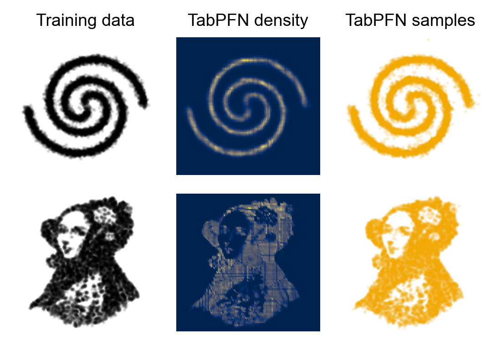

# Unconditional Figure

## Preview

## Results Sources

- `results/uncond_uci/summary.csv`

## Experiments

- `conf/experiment/uncond_uci.yaml`
- `conf/experiment/uncond_uci_tabpfn.yaml`

## Notes

- The notebook in this folder reads `results/uncond_uci/summary.csv`.
- This figure covers the unconditional UCI benchmark.
